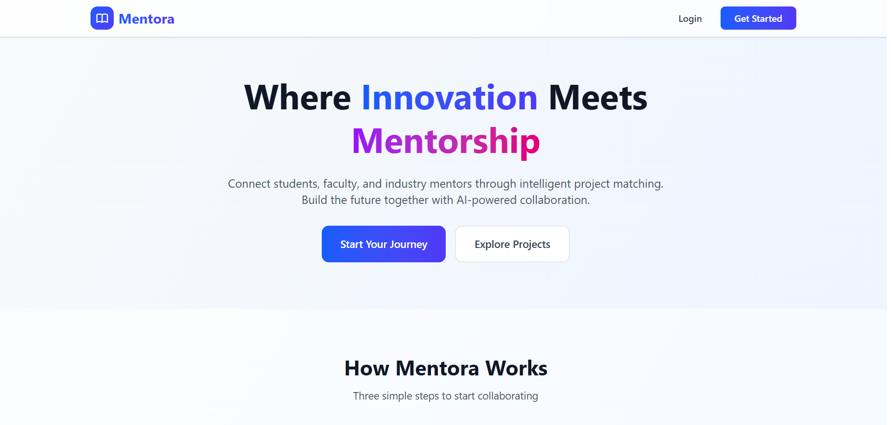
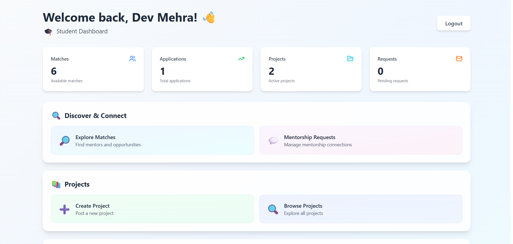
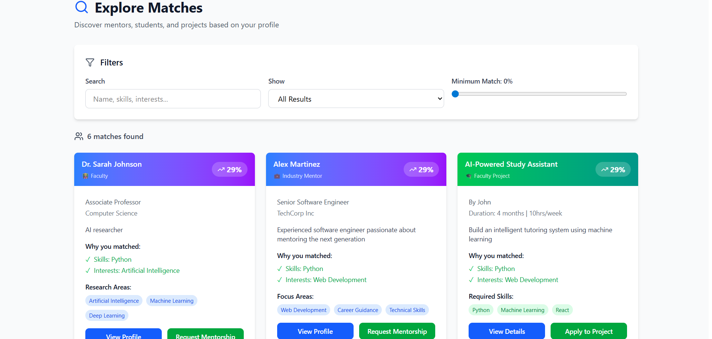

# 🪄 Mentora – University Collaboration & Project Matching Platform

<p align="center">
  
</p>

### 🔗 **Live Demo:** *https://mentora3.onrender.com*  

---

## 🧭 Overview

**Mentora** is a centralized platform designed to bridge the gap between **students**, **faculty**, and **industry mentors** by enabling:

- Project discovery  
- Mentorship opportunities  
- Skill-based matching  
- Easy collaboration  

The platform simplifies how universities handle academic projects and research opportunities by providing a modern, intelligent, and user-friendly interface for everyone involved.

---

## 🛠️ Tech Stack

### **Frontend**
- React.js  
- Tailwind CSS  
- Axios  
- React Router  

### **Backend**
- Flask (Python)  
- REST APIs  
- JWT Authentication  

### **Database & Auth**
- Supabase (PostgreSQL + Auth)  

### **Deployment**  
- Render — Frontend & Backend  

---

## ✨ Key Features

### 👨‍🎓 For Students
- Build a detailed academic + skill profile  
- Upload project ideas  
- View matching faculty mentors & industry mentors  
- Explore top recommended projects  
- Apply for projects with a cover letter  

### 👨‍🏫 For Faculty
- Create research opportunities  
- Define required skills and expertise  
- Get top student matches  
- Review student applications  
- Offer mentorship to student-initiated projects  

### 💼 For Industry Mentors
- Share real-world project opportunities  
- Mentor students on career & technical skills  
- View top student matches  
- Create practical projects aligned with industry needs  

---

## 🔍 Matching System

Mentora uses an **effective weighted matching algorithm** that compares:

- Student Skills → Faculty Expertise  
- Project Requirements → User Profiles  
- Domain Matching  
- Keyword Matching in Project Descriptions  
- User Interests  

Each Explore section shows ONLY the relevant recommendations:

| User Type | Sees |
|-----------|------|
| **Student** | Top Faculty, Top Industry Mentors, Top Projects |
| **Faculty** | Top Students, Student Projects |
| **Industry Mentor** | Top Students, Student Projects |

---

## 🖼️ Screenshots

### 📊 Student Dashboard  


### 🤖 Smart Matching  


### 📂 Active Projects  


---

## 📂 Folder Structure
```
mentora-platform/
├── frontend/ # React Frontend
├── backend/ # Flask Backend
├── docs/
│ └── screenshots/
├── README.md
└── .gitignore
```

---

## 🧪 Running the Project Locally

### 🟦 Frontend
```bash
cd frontend
npm install
npm run dev
```

### 🟧 Backend
```bash
cd backend
python3 -m venv .venv
source .venv/bin/activate 
pip install -r requirements.txt
flask run
```
### 🌐 Environment Variables

#### Backend .env

```bash
SUPABASE_URL = Supabase project URL 
SUPABASE_KEY = Supabase service role key 
JWT_SECRET = Secret key used for JWT authentication  
```
---

## 🏁 Deployment

The Mentora platform is fully deployed on **Render**.

### 🌐 Frontend Deployment  
**Render Static Site**  
- Framework: React (Vite)  
- Build Command: `npm install && npm run build`  
- Live URL: *https://mentora3.onrender.com*

### 🔧 Backend Deployment  
**Render Web Service**  
- Runtime: Python (Flask)  
- Build Command: `pip install -r requirements.txt`  
- Start Command: `gunicorn app:app`  
- Environment Variables:  
  - `SUPABASE_URL`  
  - `SUPABASE_KEY`  
  - `JWT_SECRET`  
- Live API URL: *https://mentora-backend-p9pf.onrender.com*

---

## ⭐ Want to Support This Project?

If you found this project interesting or useful, feel free to give the repository a ⭐ on GitHub!  
Your support helps improve visibility and motivates further enhancements.

---

## 👤 Author

**Ayush Rawat**  
📧 [rawat.ayush.work@gmail.com](mailto:rawat.ayush.work@gmail.com)  
🔗 [LinkedIn](https://www.linkedin.com/in/ayushrawat20)

**Mehak Choudhary**
📧 [choudharymehakk@gmail.com](mailto:choudharymehakk@gmail.com)  
🔗 [LinkedIn](https://www.linkedin.com/in/mehak-choudhary)